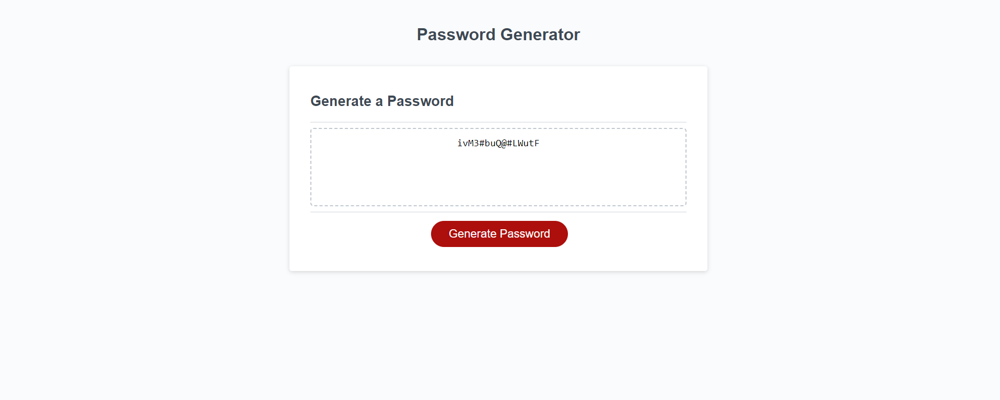

# Random-Password

## Description

In this challenge i built a program in java script to randomly generate a password for them based on their input on legnth, numbers, upper case letters, lower case letters, and symbols. the program makes sure all types of characters selected are in the password. While making this program i learned how call funtion to do specific tasks. i learned how to store user input and have fuction make decisions based on the user input.   

## Screenshot

## Credit

Worked with a partner Marcus Paccapaniccia 
This is his github https://github.com/Mpacct/Random-Password-Generator

## Link to Deployed Webpage and Repository

https://github.com/nickrosales/Random-Password
https://nickrosales.github.io/Random-Password/